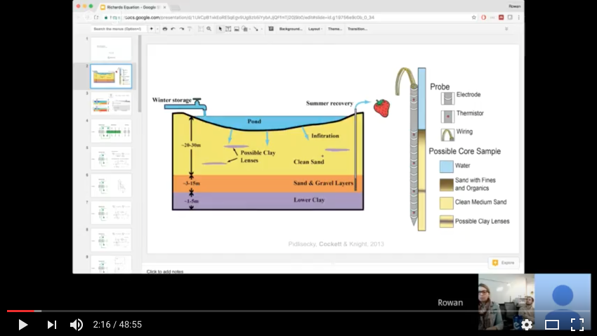

# Richards equation and multiple parameters

Presented by: [Rowan Cockett](https://github.com/rowanc1)

## Summary

I gave a quick introduction to Richards equation and some of the problems with non linear models, empirical relations, and multiple parameter inversions.

